# Punto de Control 6

## :copyright: Autor

- :camera: 

- :man: **Felix Omar Dominguez Inestroza**
- :e-mail: felixomardominguez847@gamil.com
- :link: [github.com/StickyFingers84](https://github.com/StickyFingers84)

---

## :black_circle: Principal.cpp

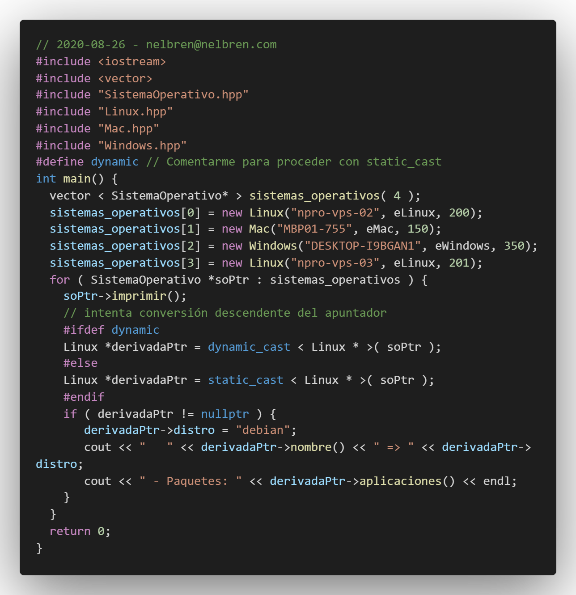

---

## :triangular_ruler: Diagrama

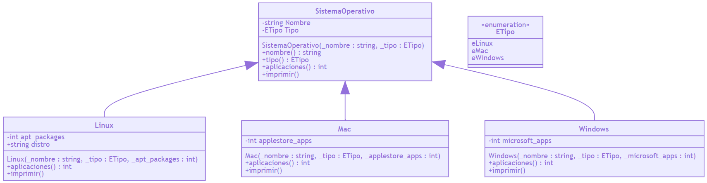

---

## :white_large_square: SistemaOperativo.hpp

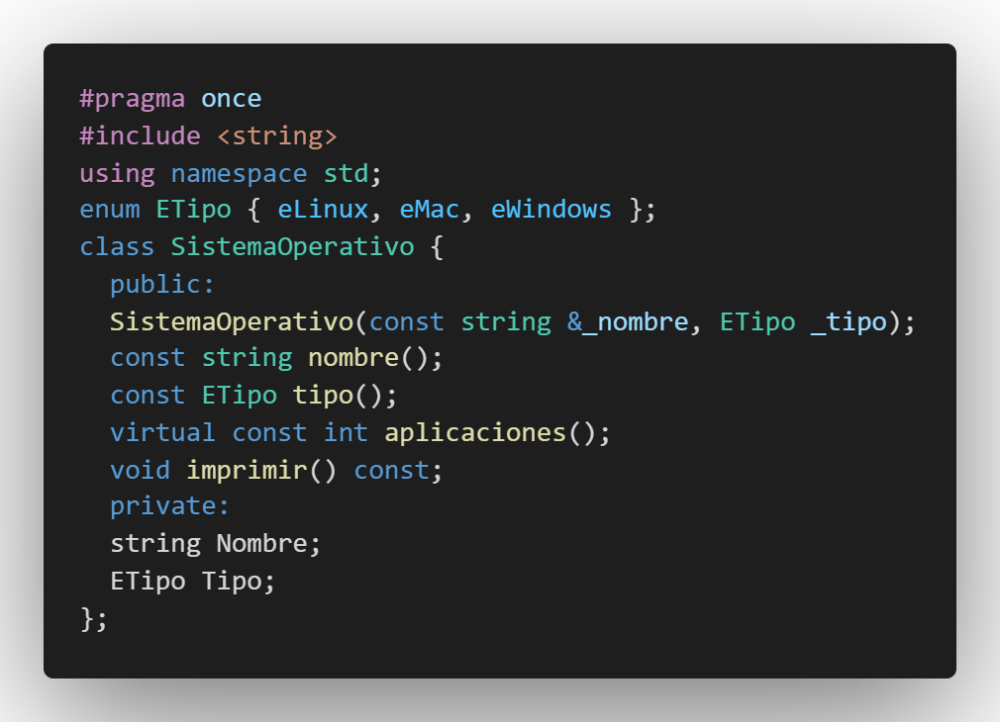

## :white_medium_square: SistemaOperativo.cpp

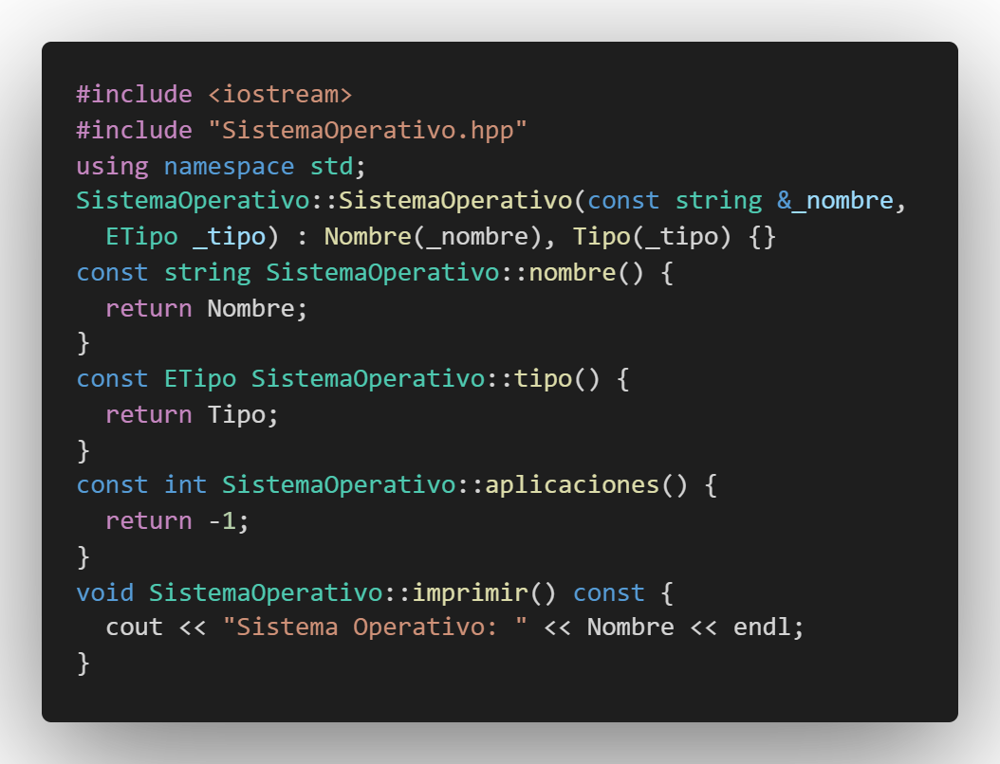

---

## :large_blue_diamond: Linux.hpp

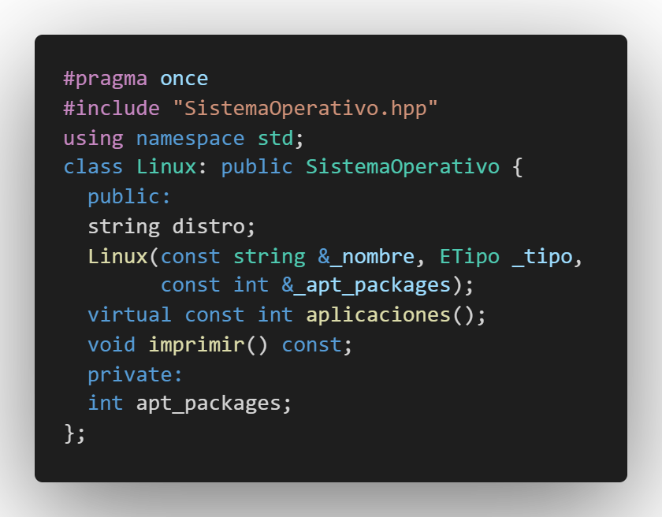

## :small_blue_diamond: Linux.cpp

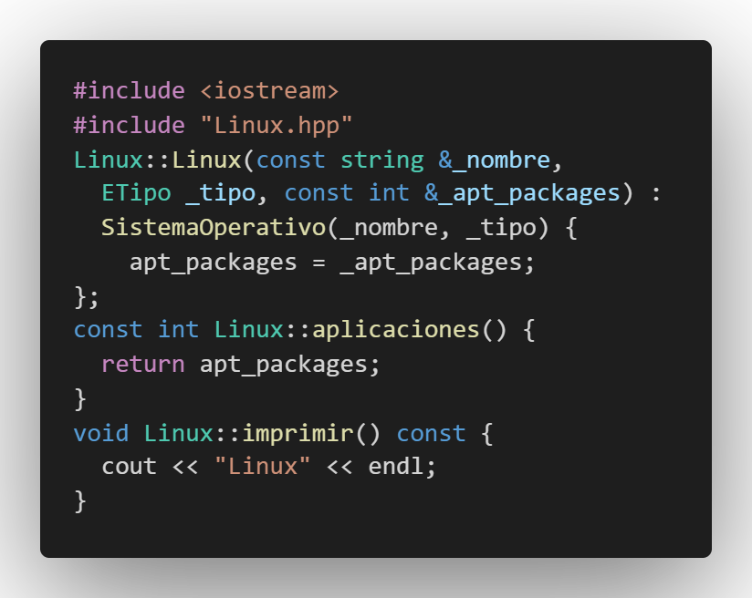

---

## :large_orange_diamond: Mac.hpp

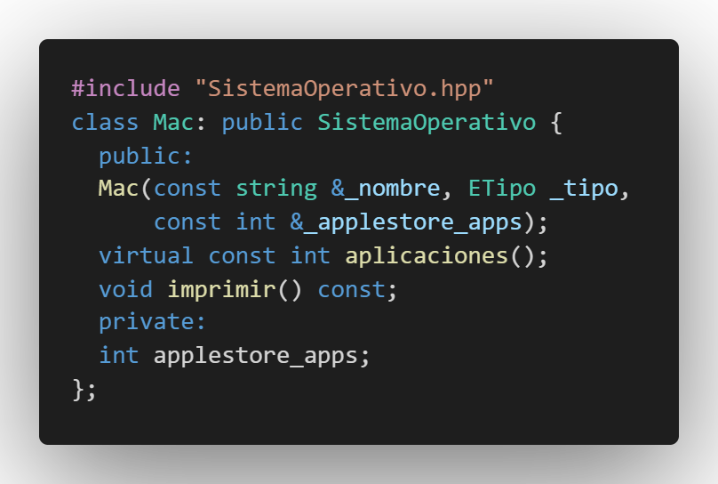

## :small_orange_diamond: Mac.cpp

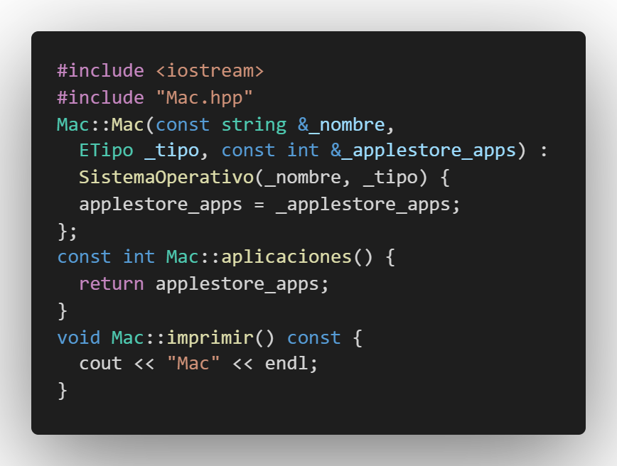

---

##  :black_large_square:  Windows.hpp

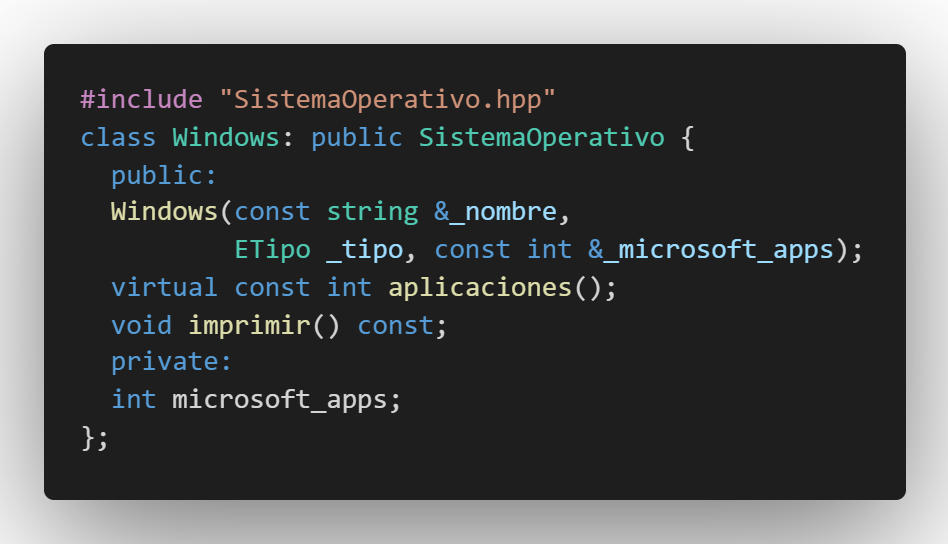

## :black_medium_small_square: Windows.cpp

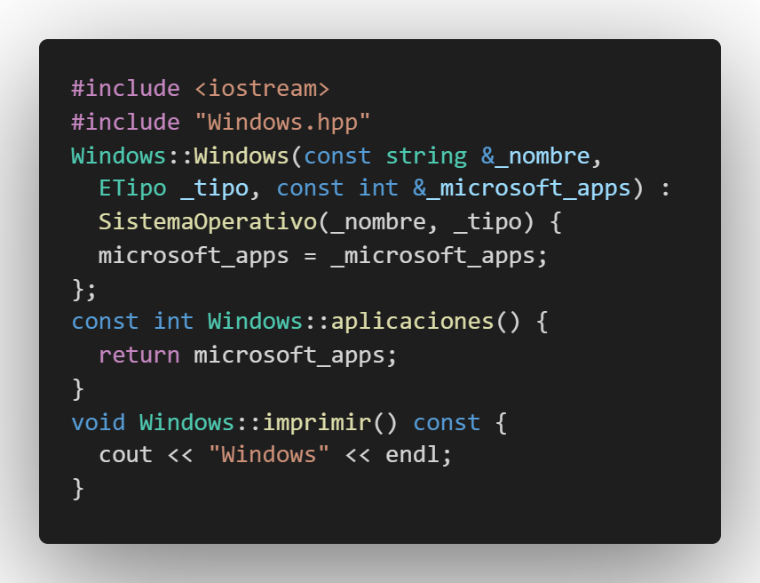

---

## :white_circle: Makefile

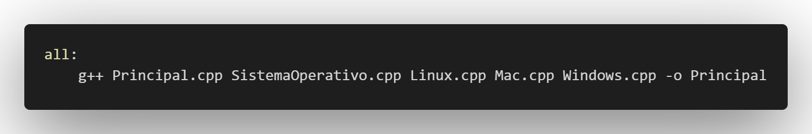

## :white_circle: Build.bash.bat

## :red_circle: Salida - dynamic_cast

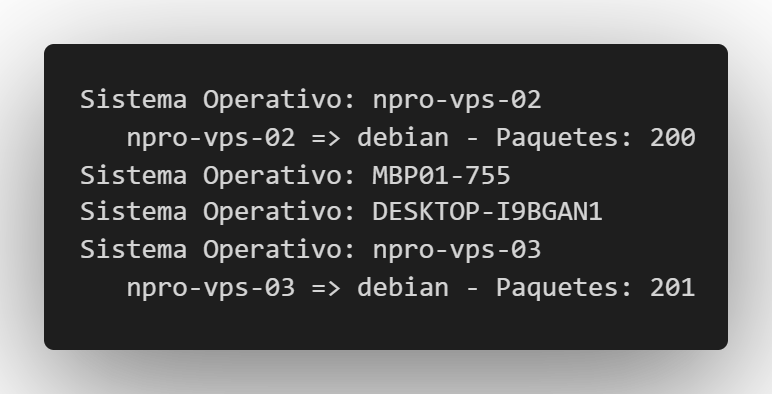

## :large_blue_circle: Salida - static_cast

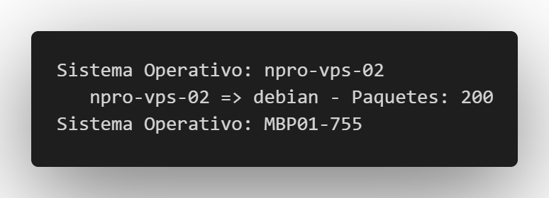

---

## :computer: Código

- :blue_book: [Ejemplo-de-static_cast-vs-dynamic_cast](https://github.com/nelbren/Ejemplo-de-static_cast-vs-dynamic_cast)

---
#### Herramientas:
- :package: [Visual Studio Code](https://code.visualstudio.com/)
- :camera: [Polacode-2020 v0.5.2](https://github.com/jeff-hykin/polacode)
- :notebook: [Markdown Cheatsheet](https://github.com/adam-p/markdown-here/wiki/Markdown-Cheatsheet)
- :smile: [Emoji Cheat Sheet](https://www.webfx.com/tools/emoji-cheat-sheet/)# PC6
